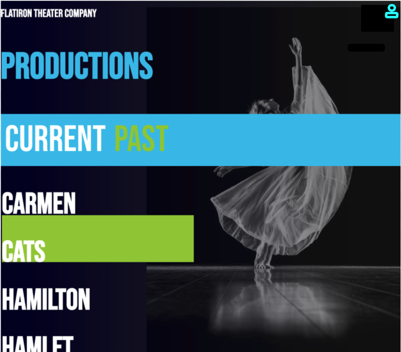
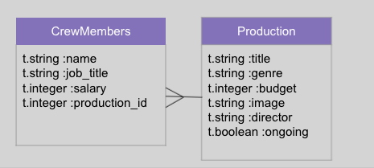

# Phase-2-Client/Server Communication 2

## SWBAT
- [ ] Use Active Record Validations 
- [ ] Generate a React applications inside of rails
- [ ] Use create-react-app's proxy to simplify requests
- [ ] Configure Validation Errors  


### What are we making?


### The backend
* Should have 2 models 
* CrewMembers > Productions


**Routs**  
`GET /Productions :` Should return a collection of cats  
`GET /Productions/:id` Should return a single production
`POST /Productions :` Creates a production   
`PUT /Productions/:id` Updates a production  
`Delete /Productions/:id` Destroys a production  

### Request Response Cycle 


### Validations 
Validations protect our DB from invalid date from our users. Invalid data can cause bugs and issues in our application. Accidental or Malicious it's important to prevent invalid data from entering our collections!

```
  validates :title, presence: true
  validates :budget, numericality: true, length: { minimum: 1000 }

```

We will need to configure out controller to send errors to the front-end
```
    production = Production.create(production_params)
      if production.valid?
          render json: production, status: :created
      else 
          render json: { error: production.errors.full_messages }, status: :unprocessable_entity
      end 
```

### Generating a React Application
Inside of your rails app, generate a react application using create-react-app
`npx create-react-app client --use-npm`

Rails and React will need to be hosted on two separate servers using different ports. Using create-react-apps proxy will simplify your requests.
Add the following to your package json`"proxy": "http://localhost:3000"`

```
"scripts": {
  "start": "PORT=4000 react-scripts start"
}

``

In a new terminal run ` npm start --prefix client`